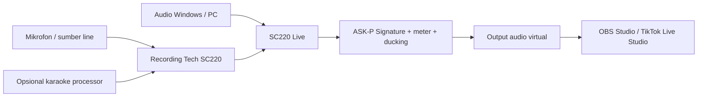

<div align="center">
  

  # SC220 Live

  **Console audio Windows yang fokus untuk Recording Tech SC220, audio karaoke, audio PC, OBS, dan TikTok Live Studio.**

  [](https://github.com/masarray/sc220-download/releases/latest)
  [](#persyaratan-sistem)
  [](https://github.com/masarray/sc220-download/actions/workflows/deploy-pages.yml)

  [Website](https://sc220.pages.dev/) · [Unduh](https://sc220.pages.dev/download/) · [Mulai](#cara-mulai) · [Dukungan](SUPPORT.md) · [English](README.md)
</div>

<p align="center">
  <a href="https://sc220.pages.dev/">
    
  </a>
</p>

## Apa itu SC220 Live?

SC220 Live adalah aplikasi audio native Windows yang menyatukan jalur live streaming ke dalam satu workspace yang jelas. Aplikasi ini menggabungkan audio dari **Recording Tech SC220** dan playback Windows, memprosesnya melalui **ASK-P Signature**, menyediakan meter serta kontrol level, lalu mengirim hasil mix menuju aplikasi streaming melalui jalur audio Windows yang kompatibel.

SC220 Live ditujukan untuk kreator, pengguna karaoke, pengajar, musisi, reviewer, dan host live yang membutuhkan cara lebih mudah untuk menyiapkan audio bersih menuju **OBS Studio** atau **TikTok Live Studio**.

> [!IMPORTANT]
> Repository ini adalah pusat distribusi dan dokumentasi publik resmi. Source code aplikasi, source DSP proprietary, material signing, infrastruktur build privat, dan credential tidak dipublikasikan di sini.

## Rilis stabil saat ini

**SC220 Live v0.1.1** — diterbitkan **10 Agustus 2026** untuk Windows 10/11 x64.

| Item | Rilis saat ini |
|---|---|
| Halaman download resmi | [sc220.pages.dev/download](https://sc220.pages.dev/download/) |
| Installer Windows | [SC220-Live-v0.1.1-Setup-win-x64.exe](https://github.com/masarray/sc220-download/releases/download/v0.1.1/SC220-Live-v0.1.1-Setup-win-x64.exe) |
| Ukuran installer | 24.043.506 byte (sekitar 22,9 MiB) |
| Catatan rilis | [RELEASE_NOTES_v0.1.1.md](RELEASE_NOTES_v0.1.1.md) |
| Metadata machine-readable | [latest.json](latest.json) |
| GitHub Release | [v0.1.1](https://github.com/masarray/sc220-download/releases/tag/v0.1.1) |

### Yang baru di v0.1.1

- Engine pemrosesan disinkronkan ke authority produksi **ASK-P v0.5.24** yang disetujui.
- Reference Bypass memakai jalur input bersama yang selaras latensi dengan transisi halus.
- Smart installer memeriksa Microsoft Visual C++ Runtime, kesiapan Windows Audio, dan kesiapan VB-CABLE sebelum aplikasi dijalankan.
- Analyzer stereo tetap membaca konten anti-phase dengan mengevaluasi energi kanal kiri dan kanan secara terpisah.
- Kontrak packaging dan verifikasi release diperkuat agar distribusi publik lebih reliable.
- SC220 Live tetap memakai lima macro kreatif yang sama; **Gain Match tetap OFF secara default dan tidak ditampilkan di UI publik**.

## Kemampuan utama

- Menggabungkan input Recording Tech SC220 dan audio Windows/PC secara independen.
- Membentuk karakter suara melalui pemrosesan ASK-P Signature.
- Memantau input, output, peak, loudness, dan aktivitas stereo sebelum live.
- Menurunkan audio PC secara otomatis ketika host berbicara melalui fungsi ducking.
- Mengirim hasil akhir menuju OBS Studio atau TikTok Live Studio.
- Menjaga kontrol audio inti tetap aktif setelah masa full control 365 hari.
- Menyediakan installer Windows versioned dengan SHA-256 dan manifest verifikasi.

## Alur sinyal



SC220 Live **bukan** software kontrol Recording Tech KTV Pro K500. Penjelasan perbedaan karaoke processor, audio interface, dan mixer Windows tersedia pada [panduan KTV Pro K500](https://sc220.pages.dev/ktv-k500-karaoke-processor/).

## Verifikasi installer

SHA-256 installer saat ini:

```text
589b174357cb36c62611d7a0e89bfa6a7d25251fc27015b5dd5b25fb54c04686
```

Jalankan di Windows PowerShell:

```powershell
Get-FileHash .\SC220-Live-v0.1.1-Setup-win-x64.exe -Algorithm SHA256
```

Hasilnya harus sama persis dengan checksum yang dipublikasikan. Release juga menyediakan file `.sha256` dan manifest supply-chain.

> [!NOTE]
> Windows SmartScreen dapat menampilkan peringatan unknown publisher sampai sertifikat code-signing khusus aplikasi tersedia. Selalu unduh dari repository atau website resmi dan periksa SHA-256 bila ragu.

## Cara mulai

1. Buka [halaman download resmi SC220 Live](https://sc220.pages.dev/download/) dan unduh installer.
2. Verifikasi SHA-256 bila pemeriksaan integritas diperlukan.
3. Jalankan installer sebagai Administrator dan ikuti pemeriksaan prasyaratnya.
4. Pasang Standard VB-Audio VB-CABLE hanya bila jalur streaming Anda membutuhkannya.
5. Di SC220 Live, pilih input SC220 dan sumber playback Windows yang benar.
6. Pilih `CABLE Input` sebagai Stream Output bila menggunakan standard VB-CABLE.
7. Di OBS atau TikTok Live Studio pilih `CABLE Output` sebagai input audio.
8. Buat rekaman tes dan periksa level sebelum GO LIVE.

## Persyaratan sistem

- Windows 10 atau Windows 11, 64-bit.
- Recording Tech SC220 atau perangkat input audio Windows yang kompatibel.
- Perangkat playback Windows aktif untuk audio PC.
- OBS Studio, TikTok Live Studio, atau aplikasi lain yang menerima perangkat audio Windows.
- Opsional Standard VB-Audio VB-CABLE atau jalur audio virtual kompatibel lainnya.

## Isi repository

Repository publik ini memuat:

- Landing page produksi dan dokumentasi Indonesia/Inggris.
- Metadata rilis resmi dan catatan rilis pengguna.
- Installer versioned, checksum, dan manifest melalui GitHub Releases.
- Dokumentasi support, security, dan kontribusi publik.
- Otomasi deployment Cloudflare Pages dan GitHub Pages mirror.

Repository ini tidak memuat:

- Source code aplikasi atau debug symbol.
- Source implementasi DSP proprietary.
- API credential, signing key, sertifikat, atau secret.
- Infrastruktur CI/CD dan release privat.

## Dukungan dan keamanan

- Baca [SUPPORT.md](SUPPORT.md) sebelum membuka issue.
- Gunakan formulir [bug report](https://github.com/masarray/sc220-download/issues/new?template=bug-report.yml) untuk masalah yang dapat direproduksi.
- Baca [SECURITY.md](SECURITY.md) sebelum melaporkan kerentanan.
- Perbaikan dokumentasi dan website publik mengikuti [CONTRIBUTING.md](CONTRIBUTING.md).

## Integritas rilis

Setiap rilis publik diharapkan dapat ditelusuri melalui:

1. GitHub Release dengan versi jelas.
2. Installer Windows dengan nama file stabil.
3. File checksum SHA-256.
4. Manifest machine-readable.
5. Catatan rilis publik.
6. Entry yang sesuai di `latest.json`.

Hindari installer repackaged dari situs berbagi file pihak ketiga.

## Merek dan nama produk

SC220 Live dikelola oleh MasArray / Recording Tech. Windows, OBS Studio, TikTok, VB-Audio, dan nama produk pihak ketiga lainnya merupakan milik pemegang hak masing-masing dan disebut hanya untuk kompatibilitas, identifikasi, serta edukasi teknis.

---

<div align="center">
  <strong>SC220 Live v0.1.1</strong><br>
  Routing bersih. Kontrol jelas. Siap siaran.
</div>
