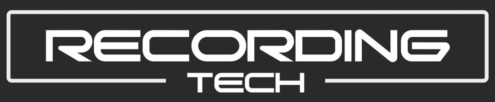
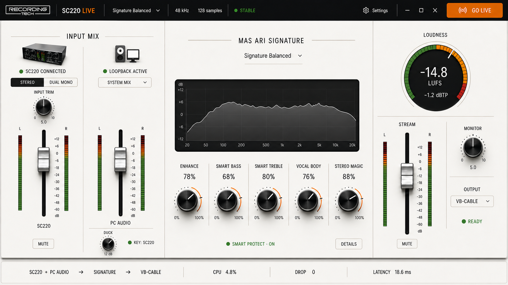
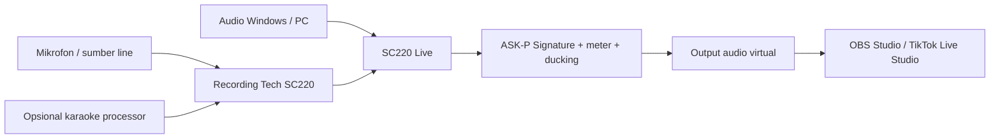

<div align="center">
  

  # SC220 Live

  **Console audio Windows yang fokus untuk Recording Tech SC220, audio karaoke, audio PC, OBS, dan TikTok Live Studio.**

  [](https://github.com/masarray/sc220-download/releases/latest)
  [](#persyaratan-sistem)
  [](https://github.com/masarray/sc220-download/actions/workflows/deploy-pages.yml)

  [Website](https://masarray.github.io/sc220-download/) · [Unduh](https://github.com/masarray/sc220-download/releases/latest) · [Mulai](#cara-mulai) · [Dukungan](SUPPORT.md) · [English](README.md)
</div>

<p align="center">
  <a href="https://masarray.github.io/sc220-download/">
    
  </a>
</p>

## Apa itu SC220 Live?

SC220 Live adalah aplikasi audio native Windows yang menyatukan jalur live streaming ke dalam satu workspace yang jelas. Aplikasi ini menggabungkan audio dari **Recording Tech SC220** dan playback Windows, memprosesnya melalui **ASK-P Signature**, menyediakan meter serta kontrol level, lalu mengirim hasil mix menuju aplikasi streaming melalui jalur audio virtual yang kompatibel.

SC220 Live ditujukan untuk kreator, pengguna karaoke, pengajar, musisi, dan host live yang membutuhkan cara lebih mudah untuk menyiapkan audio bersih menuju **OBS Studio** atau **TikTok Live Studio**.

> [!IMPORTANT]
> Repository ini adalah pusat distribusi dan dokumentasi publik resmi. Source code aplikasi, material signing, infrastruktur build privat, dan credential tidak dipublikasikan di sini.

## Kemampuan utama

- Menggabungkan input Recording Tech SC220 dan audio Windows/PC secara independen.
- Membentuk karakter suara melalui pemrosesan ASK-P Signature.
- Memantau input, output, peak, dan aktivitas stereo sebelum live.
- Menurunkan audio PC secara otomatis ketika host berbicara melalui fungsi ducking.
- Mengirim hasil akhir menuju OBS Studio atau TikTok Live Studio.
- Menjaga kontrol audio inti tetap aktif setelah masa full control 365 hari.
- Menyediakan installer Windows dengan file verifikasi SHA-256.

## Alur sinyal



SC220 Live **bukan** software kontrol Recording Tech KTV Pro K500. Penjelasan perbedaan karaoke processor, audio interface, dan mixer Windows tersedia pada [panduan KTV Pro K500](https://masarray.github.io/sc220-download/ktv-k500-karaoke-processor/).

## Unduh

Rilis stabil saat ini adalah **SC220 Live v0.1.0** untuk Windows 10/11 x64.

| Item | Tautan resmi |
|---|---|
| Installer Windows | [Unduh rilis terbaru](https://github.com/masarray/sc220-download/releases/latest) |
| Catatan rilis | [RELEASE_NOTES_v0.1.0.md](RELEASE_NOTES_v0.1.0.md) |
| Metadata machine-readable | [latest.json](latest.json) |
| Website produk | [masarray.github.io/sc220-download](https://masarray.github.io/sc220-download/) |

### Verifikasi installer

SHA-256 installer saat ini:

```text
c8a441f07605f48805233fbddf466312c1de733c647c95705317ad13ee2b7b04
```

Jalankan melalui Windows PowerShell:

```powershell
Get-FileHash .\SC220-Live-v0.1.0-Setup-win-x64.exe -Algorithm SHA256
```

Hasilnya harus sama persis dengan checksum yang dipublikasikan. Aset rilis juga menyertakan file checksum dan supply-chain manifest.

> [!NOTE]
> Windows SmartScreen mungkin menampilkan peringatan unknown publisher sampai sertifikat code-signing khusus tersedia. Selalu unduh dari repository atau website resmi dan periksa SHA-256.

## Cara mulai

1. Unduh installer dari [GitHub Release terbaru](https://github.com/masarray/sc220-download/releases/latest).
2. Verifikasi checksum SHA-256 sebelum instalasi.
3. Instal atau atur virtual audio cable yang kompatibel bila diperlukan oleh alur streaming.
4. Pilih perangkat input SC220 yang benar dan sumber playback Windows di SC220 Live.
5. Atur level secara konservatif, pastikan meter bergerak, dan periksa clipping atau pemrosesan berlebihan.
6. Pilih output virtual SC220 Live di OBS Studio atau TikTok Live Studio.
7. Uji seluruh jalur sebelum mengaktifkan siaran live.

## Persyaratan sistem

- Windows 10 atau Windows 11, 64-bit.
- Recording Tech SC220 atau perangkat input audio Windows yang kompatibel.
- Perangkat playback Windows aktif untuk audio PC.
- OBS Studio, TikTok Live Studio, atau aplikasi lain yang menerima perangkat audio Windows.
- Opsional VB-Audio VB-CABLE atau jalur audio virtual setara.

## Isi repository

Repository publik ini memuat:

- Landing page produksi dan halaman SEO Indonesia/Inggris.
- Metadata rilis resmi dan catatan rilis pengguna.
- Installer versioned, checksum, dan manifest.
- Dokumentasi support, security, dan kontribusi publik.
- Otomasi deployment GitHub Pages.

Repository ini tidak memuat:

- Source code aplikasi atau debug symbols.
- API credential, signing key, sertifikat, atau secret.
- Infrastruktur CI/CD privat.
- Detail implementasi DSP proprietary.

## Dukungan dan keamanan

- Baca [SUPPORT.md](SUPPORT.md) sebelum membuka issue.
- Gunakan formulir [bug report](https://github.com/masarray/sc220-download/issues/new?template=bug-report.yml) untuk masalah yang dapat direproduksi.
- Baca [SECURITY.md](SECURITY.md) sebelum melaporkan kerentanan.
- Perbaikan dokumentasi dan website publik mengikuti [CONTRIBUTING.md](CONTRIBUTING.md).

## Integritas rilis

Setiap rilis publik seharusnya dapat ditelusuri melalui:

1. GitHub Release dengan versi jelas.
2. Installer Windows dengan nama file stabil.
3. File checksum SHA-256.
4. Manifest machine-readable.
5. Catatan rilis publik.
6. Entry yang sesuai di `latest.json`.

Hindari installer repackaged dari situs berbagi file pihak ketiga.

## Merek dan nama produk

SC220 Live dikelola oleh MasArray / Recording Tech. Windows, OBS Studio, TikTok, VB-Audio, dan nama produk pihak ketiga lainnya merupakan milik pemegang hak masing-masing dan disebut hanya untuk kompatibilitas, identifikasi, serta edukasi teknis.

---

<div align="center">
  <strong>SC220 Live</strong><br>
  Routing bersih. Kontrol jelas. Siap siaran.
</div>
