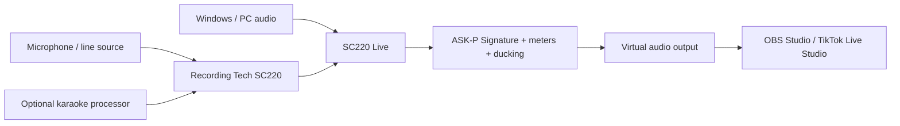

<div align="center">
  

  # SC220 Live

  **A focused Windows audio console for Recording Tech SC220, karaoke audio, PC playback, OBS, and TikTok Live Studio.**

  [](https://github.com/masarray/sc220-download/releases/latest)
  [](#system-requirements)
  [](https://github.com/masarray/sc220-download/actions/workflows/deploy-pages.yml)
  [](#repository-scope)

  [Website](https://sc220.pages.dev/) · [Download](https://sc220.pages.dev/en/download/) · [Setup](#quick-start) · [Support](SUPPORT.md) · [Bahasa Indonesia](README.id.md)
</div>

<p align="center">
  <a href="https://sc220.pages.dev/">
    
  </a>
</p>

## What is SC220 Live?

SC220 Live is a native Windows audio application designed to bring a practical live-streaming signal path into one clear workspace. It combines audio from **Recording Tech SC220** and Windows playback, applies the **ASK-P Signature** processing chain, provides metering and level control, and sends the final mix to streaming software through a compatible virtual audio route.

It is intended for creators, karaoke users, educators, musicians, and live hosts who need a simpler way to prepare clean audio for **OBS Studio** or **TikTok Live Studio**.

> [!IMPORTANT]
> This repository is the official public distribution and documentation surface. The application source code, signing material, private build infrastructure, and credentials are maintained separately and are not published here.

## Core capabilities

- Mix Recording Tech SC220 input and Windows/PC audio independently.
- Shape the final sound with ASK-P Signature processing.
- Monitor input, output, peak, and stereo activity before going live.
- Apply automatic ducking so PC audio lowers while the host speaks.
- Route the finished mix to OBS Studio or TikTok Live Studio.
- Keep core audio controls available after the 365-day full-control period.
- Download versioned Windows installers with SHA-256 verification files.

## Signal flow



SC220 Live is **not** control software for Recording Tech KTV Pro K500. For a clear explanation of how a karaoke processor, audio interface, and Windows mixer differ, see the [KTV Pro K500 karaoke processor guide](https://sc220.pages.dev/en/ktv-k500-karaoke-processor/).

## Download

The current stable release is **SC220 Live v0.1.0** for Windows 10/11 x64.

| Item | Official link |
|---|---|
| Official download page | [sc220.pages.dev/en/download](https://sc220.pages.dev/en/download/) |
| Windows installer | [Download latest release](https://github.com/masarray/sc220-download/releases/latest) |
| Release notes | [RELEASE_NOTES_v0.1.0.md](RELEASE_NOTES_v0.1.0.md) |
| Machine-readable metadata | [latest.json](latest.json) |
| Product website | [sc220.pages.dev](https://sc220.pages.dev/) |

### Verify the installer

Current installer SHA-256:

```text
c8a441f07605f48805233fbddf466312c1de733c647c95705317ad13ee2b7b04
```

On Windows PowerShell:

```powershell
Get-FileHash .\SC220-Live-v0.1.0-Setup-win-x64.exe -Algorithm SHA256
```

The result must match the published checksum exactly. Release assets also include a checksum file and a supply-chain manifest.

> [!NOTE]
> Windows SmartScreen may show an unknown-publisher warning until a dedicated application code-signing certificate is deployed. Always download from this repository or the official website and verify the SHA-256 value.

## Quick start

1. Open the [official SC220 Live download page](https://sc220.pages.dev/en/download/) and download the installer from GitHub Releases.
2. Verify the SHA-256 checksum before installation.
3. Install or configure a compatible virtual audio cable when your streaming workflow requires one.
4. In SC220 Live, select the real SC220 input device and the desired Windows playback source.
5. Set conservative levels, confirm the meters are active, and listen for clipping or excessive processing.
6. Select the SC220 Live virtual output in OBS Studio or TikTok Live Studio.
7. Test the entire path before enabling the live broadcast.

## System requirements

- Windows 10 or Windows 11, 64-bit.
- Recording Tech SC220 or another compatible Windows audio input device.
- A working Windows playback device for PC audio.
- OBS Studio, TikTok Live Studio, or another application that accepts Windows audio devices.
- Optional VB-Audio VB-CABLE or an equivalent virtual audio route.

## Repository scope

This public repository contains:

- The production landing page and English/Indonesian SEO pages.
- Official release metadata and user-facing release notes.
- Versioned installer assets, checksums, and manifests.
- Public support, security, and contribution documentation.
- Cloudflare Pages deployment automation plus the GitHub Pages mirror.

It does **not** contain:

- Application source code or debug symbols.
- API credentials, signing keys, certificates, or secrets.
- Private CI/CD infrastructure.
- Proprietary DSP implementation details.

## Support and security

- Read [SUPPORT.md](SUPPORT.md) before opening an issue.
- Use the structured [bug report](https://github.com/masarray/sc220-download/issues/new?template=bug-report.yml) for reproducible problems.
- Read [SECURITY.md](SECURITY.md) before reporting a vulnerability.
- Documentation and public-site improvements may follow [CONTRIBUTING.md](CONTRIBUTING.md).

## Release integrity

Every public release should be traceable through:

1. A versioned GitHub Release.
2. A Windows installer with a stable filename.
3. A SHA-256 checksum file.
4. A machine-readable manifest.
5. Public release notes.
6. A matching entry in `latest.json`.

Do not download repackaged installers from third-party file-sharing sites.

## Trademarks and product names

SC220 Live is maintained by MasArray / Recording Tech. Windows, OBS Studio, TikTok, VB-Audio, and other third-party product names belong to their respective owners and are referenced only for compatibility, identification, and technical education.

---

<div align="center">
  <strong>SC220 Live</strong><br>
  Clean routing. Clear controls. Ready for broadcast.
</div>
